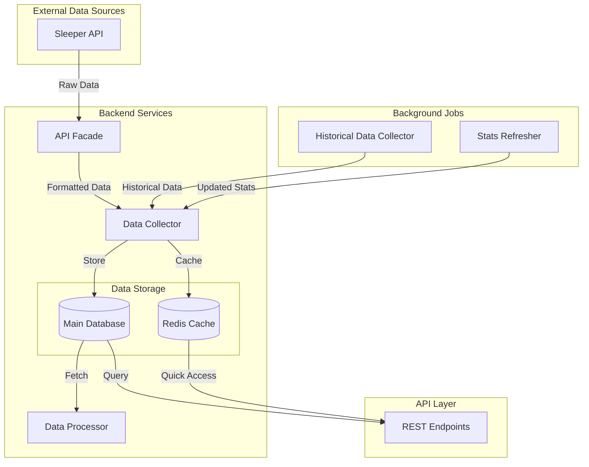

* Diagram

 
Architecture

 Early architecture sketch

```mermaid
flowchart TB
    subgraph External["External Data Sources"]
        S[Sleeper API]
    end

    subgraph Backend["Backend Services"]
        direction TB
        AF["API Facade"]
        DC["Data Collector"]
        DP["Data Processor"]
        
        subgraph Storage["Data Storage"]
            DB[(Main Database)]
            Cache[(Redis Cache)]
        end
        
        S -->|Raw Data| AF
        AF -->|Formatted Data| DC
        DC -->|Store| DB
        DC -->|Cache| Cache
        DB -->|Fetch| DP
    end

    subgraph Jobs["Background Jobs"]
        direction LR
        HDC["Historical Data Collector"]
        SR["Stats Refresher"]
        
        HDC -->|Historical Data| DC
        SR -->|Updated Stats| DC
    end

    subgraph API["API Layer"]
        REST["REST Endpoints"]
        DB -->|Query| REST
        Cache -->|Quick Access| REST
    end
```